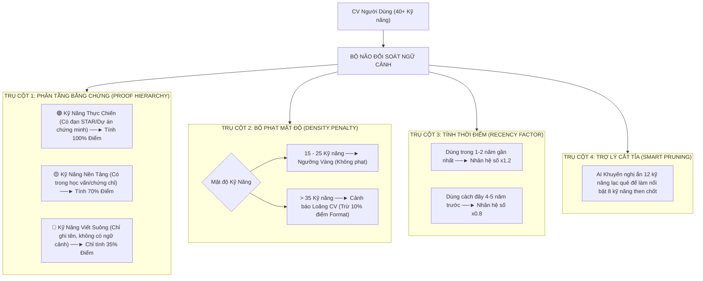

# 📋 KẾ HOẠCH CHI TIẾT: GIẢI PHÁP CHỐNG NHỒI NHÉT KỸ NĂNG & ĐÁNH GIÁ CHIỀU SÂU NĂNG LỰC THỰC CHIẾN (ANTI-KEYWORD STUFFING)

> **Mã kế hoạch:** `docs/PLAN-anti-keyword-stuffing.md`  
> **Chế độ:** 📝 **PLANNING ONLY (Không viết code)**  
> **Người lập kế hoạch:** `@[project-planner]`, `@[ai-engineer]`, `@[backend-architect]`  
> **Mục tiêu:** Xây dựng giải pháp kỹ thuật và thuật toán hoàn chỉnh để giải quyết triệt để tình trạng **"Ứng viên nhồi nhét quá nhiều kỹ năng vào CV (Keyword Stuffing), liệt kê suông không chất lượng, làm loãng hồ sơ"**.

---

## 🎯 1. BẢN CHẤT VẤN ĐỀ TRONG THỰC TẾ TUYỂN DỤNG

| Vấn đề | Hiện tượng trên CV | Hậu quả đối với Nhà tuyển dụng & Ứng viên |
|:---|:---|:---|
| **Nhồi nhét từ khóa (Keyword Stuffing)** | Ứng viên copy 40–70 từ khóa công nghệ vào mục "Kỹ năng" để qua mặt bộ lọc tìm kiếm đơn giản. | Tạo cảm giác thiếu trung thực; khi phỏng vấn kỹ thuật thực tế thì không trả lời được. |
| **Hiệu ứng pha loãng (Dilution Effect)** | Liệt kê quá nhiều kỹ năng tạp nham (Ví dụ: Ứng tuyển *Senior Backend* nhưng ghi cả *Photoshop, Canva, SEO, Word, HTML/CSS cơ bản*). | Làm mờ nhạt định vị vai trò chính (Role Clarity); nhà tuyển dụng không biết đâu là thế mạnh cốt lõi. |
| **Liệt kê suông (Unverified Skills)** | Kỹ năng chỉ xuất hiện trong danh sách "gạch đầu dòng" mà toàn bộ phần **Kinh nghiệm** và **Dự án** không hề nhắc đến việc áp dụng vào đâu. | Kỹ năng không có giá trị thực chiến, không chứng minh được năng lực giải quyết bài toán thực tế. |

---

## 🏛️ 2. MÔ HÌNH 4 TRỤ CỘT GIẢI QUYẾT (THE 4-PILLAR ARCHITECTURE)

---

## 🔍 3. CHI TIẾT 4 CƠ CHẾ NÂNG CẤP BỘ CHẤM ĐIỂM

### 🔹 Cơ chế 1: Phân Tầng Bằng Chứng Ngữ Cảnh (Contextual Proof Verification)
* **Nguyên tắc:** Kỹ năng chỉ có giá trị cao nhất khi đi kèm hành động và kết quả.
* **Cách AI phân loại từng kỹ năng:**
  1. **Tier 1 — Kỹ năng Thực chiến (Proven Skills):**
     * Điều kiện: Kỹ năng vừa có trong danh mục kỹ năng, vừa được nhắc đến trong các gạch đầu dòng kinh nghiệm/dự án với câu thành tựu cụ thể.
     * Trọng số: **100% giá trị điểm**.
     * Hiển thị: Gắn huy hiệu `✓ Đã xác thực qua dự án`.
  2. **Tier 2 — Kỹ năng Nền tảng (Contextual Skills):**
     * Điều kiện: Kỹ năng có trong học vấn, chứng chỉ hoặc dự án môn học.
     * Trọng số: **70% giá trị điểm**.
  3. **Tier 3 — Kỹ năng Liệt kê suông (Listed-only / Unverified Skills):**
     * Điều kiện: Ứng viên chỉ gõ tên kỹ năng trong danh sách, toàn bộ phần kinh nghiệm không thấy áp dụng.
     * Trọng số: **Chỉ nhận 30% - 40% giá trị điểm**.
     * Hiển thị: Gắn cảnh báo `⚠ Chưa có dự án chứng minh`.

---

### 🔹 Cơ chế 2: Bộ Phạt Nhồi Nhét & Đo Độ Tập Trung (Stuffing Penalty & Focus Index)
* **Ngưỡng Vàng Tinh Gọn (Elite 10-15 Skills Rule):** Một CV chuẩn quốc tế chỉ nên tập trung vào **10 đến 15 kỹ năng then chốt** ("Vũ khí sắc bén") được chia làm 3 nhóm:
  1. **5–7 Kỹ năng Cốt lõi (Primary Core):** Khớp trực tiếp với JD, bắt buộc có dự án và số liệu chứng minh (VD: Python, FastAPI, PostgreSQL, Redis, Docker).
  2. **3–5 Kỹ năng Bổ trợ Hạ tầng/Kiến trúc (Secondary Architecture):** (VD: CI/CD, Kubernetes, Microservices, Kafka).
  3. **2–3 Kỹ năng Phương pháp kỹ thuật (Engineering Practices):** (VD: Unit Testing/pytest, Code Review, Agile/Scrum).
* **Công thức đánh giá:**
  * **10 – 15 Kỹ năng + Có dự án chứng minh:** Đạt điểm ATS tuyệt đối (90–98 điểm A+).
  * **> 20 Kỹ năng:** Hệ thống gắn cờ cảnh báo: *"CV đang có dấu hiệu dàn trải ({total_skills} kỹ năng). Hãy tinh gọn về 10 - 15 kỹ năng có số liệu thực chiến để tăng tối đa độ tin cậy với nhà tuyển dụng."*
  * **> 30 Kỹ năng:** Gắn trạng thái `skill_density_status: "bloated"` và trừ từ **10 đến 15 điểm** ở cột điểm **Format/Readability Quality**.

---

### 🔹 Cơ chế 3: Ma Trận Thời Điểm Sử Dụng (Recency Weighting)
* **Kỹ năng Cốt lõi (Recent / Primary):** Được sử dụng trong công việc gần nhất (1–2 năm gần đây) $\rightarrow$ Được nhân hệ số **$1.2\times$**.
* **Kỹ năng Lịch sử (Legacy / Historical):** Được sử dụng từ công việc cách đây 4–5 năm hoặc đồ án thời sinh viên $\rightarrow$ Chỉ nhân hệ số **$0.8\times$**.

---

### 🔹 Cơ chế 4: Trợ Lý AI "Cắt Tỉa Kỹ Năng Thông Minh" (AI Skill Pruner)
* Trên Báo cáo ATS, hệ thống sẽ mở thêm mục **"Lời Khuyên Cắt Tỉa Kỹ Năng (Smart Pruning Advice)"**:
  * 💡 *Mẫu phản hồi của AI:*
    > *"Bạn đang để **46 kỹ năng** trên CV. Đối với vị trí **Senior Backend Engineer**, việc giữ các kỹ năng như **Photoshop, Content Marketing, Canva, HTML cơ bản** đang làm loãng CV của bạn.  
    > 👉 **Khuyến nghị:** Hãy ẩn 12 kỹ năng ngoại vi này để làm nổi bật 8 kỹ năng then chốt: **Python, FastAPI, PostgreSQL, Redis, Docker, Microservices, CI/CD, Qdrant**."*

---

## 📐 4. CÔNG THỨC TOÁN HỌC MỚI CHO BỘ ĐIỂM KỸ NĂNG

$$\text{Điểm Kỹ Năng Mới} = \frac{\sum (\text{Kỹ năng khớp} \times \text{Hệ số Ngữ Cảnh} \times \text{Hệ số Gần Đây})}{\text{Tổng kỹ năng bắt buộc của JD}} \times \text{Hệ số Tập Trung}$$

* **Hệ số Ngữ Cảnh:** $1.0$ (nếu có dự án chứng minh) hoặc $0.35$ (nếu chỉ liệt kê suông).
* **Hệ số Gần Đây:** $1.2$ (dùng gần nhất), $1.0$ (dùng đều đặn), $0.8$ (dùng quá khứ).
* **Hệ số Tập Trung:** $1.0$ (CV tinh gọn 15-25 skills) hoặc $0.85$ (CV nhồi nhét > 35 skills).

---

## 🗺️ 5. LỘ TRÌNH TRIỂN KHAI DỰ KIẾN (KHI BẠN SẴN SÀNG CODE)

| Bước | Thành phần | Nội dung sẽ triển khai |
|:---|:---|:---|
| **Bước 1** | `ai/models/jd.py` | Bổ sung các trường `has_contextual_proof`, `recency_tier`, `proof_snippet`, `skill_density_status`, `pruning_suggestions`. |
| **Bước 2** | `ai/prompts/ats_scoring.md` | Hướng dẫn AI đối soát chéo giữa mục Kỹ năng và phần Kinh nghiệm/Dự án để tìm bằng chứng thực tế. |
| **Bước 3** | `ai/analysis/ats_matcher.py` | Cập nhật hàm `_normalize_report()` tính toán tự động tỷ lệ `verified_skills_ratio` và áp dụng bộ phạt nếu CV bị nhồi nhét. |
| **Bước 4** | `fe/src/components/ATSResult.tsx` | Hiển thị huy hiệu `✓ Có dự án chứng minh` trên từng thẻ kỹ năng và khối `✂️ Lời khuyên cắt tỉa kỹ năng`. |
| **Bước 5** | `ai/tests/test_ats_matcher.py` | Viết unit tests kiểm chứng: CV 18 kỹ năng thực chiến đạt điểm cao hơn CV 50 kỹ năng nhồi nhét. |

---

## ❓ CÂU HỎI ĐỊNH HƯỚNG CHO BẠN (SOCRATIC CHECK)

1. **Về mức độ phạt kỹ năng viết suông:**
   - Bạn có đồng ý với mức: *Kỹ năng có dự án chứng minh = 100% điểm; Kỹ năng chỉ ghi tên suông = 35% điểm* không? Hay bạn muốn một tỷ lệ khác (ví dụ: 50%)?
2. **Về ngưỡng số lượng kỹ năng tối ưu:**
   - Ngưỡng **15 - 25 kỹ năng** có phù hợp với định hướng sản phẩm của bạn không, hay bạn muốn cho phép số lượng linh hoạt hơn theo số năm kinh nghiệm (VD: Fresher 12-15 skills, Senior 20-30 skills)?
