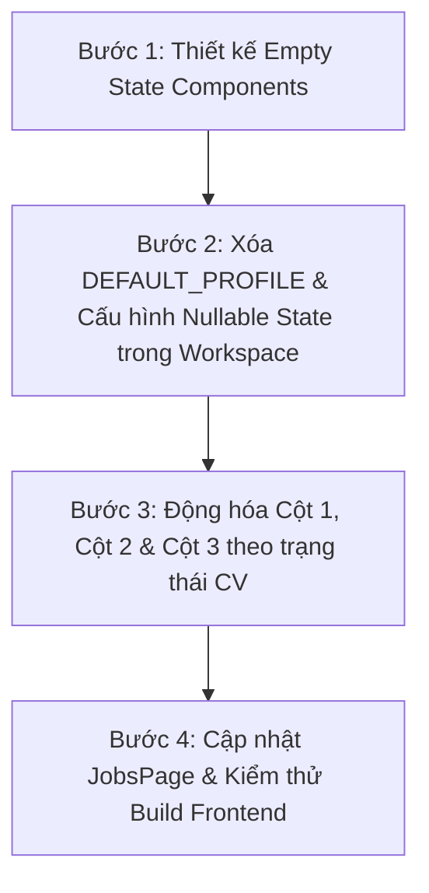

# 📋 KẾ HOẠCH: XÓA BỎ TOÀN BỘ MOCK DATA & CHUYỂN SANG DỮ LIỆU ĐỘNG (EMPTY STATES)

> **Mã kế hoạch:** `docs/PLAN-remove-mock-data.md`  
> **Người thực hiện:** `@[project-planner]`, `@[frontend-specialist]`, `@[backend-specialist]`  
> **Mục tiêu:** Loại bỏ hoàn toàn các dữ liệu giả (Hardcoded Mock Data: Hồ sơ mẫu Nguyễn Văn An, Việc làm mẫu VNG/MoMo, Chat mẫu) và thay thế bằng trải nghiệm **Empty State cao cấp + Dữ liệu động 100% từ CV/JD thực tế của người dùng**.

---

## 🔍 HIỆN TRẠNG MOCK DATA CẦN XỬ LÝ

| Vị trí | Tệp nguồn | Mock Data hiện tại | Giải pháp thay thế (Production-Ready) |
|:---|:---|:---|:---|
| **Cột 1: Profile Preview** | `fe/src/pages/WorkspacePage.tsx` | `DEFAULT_PROFILE` (Hồ sơ mẫu "Nguyễn Văn An" 4 năm kinh nghiệm) | Khi chưa có CV: Hiển thị **Empty State** với nút CTA nổi bật "Tải Lên CV Của Bạn Để Bắt Đầu". Khi đã tải CV: Hiển thị 100% dữ liệu bóc tách từ file người dùng. |
| **Cột 2: AI Career Chat** | `fe/src/pages/WorkspacePage.tsx` | Tin nhắn chào mừng và Chuỗi suy luận AI mẫu bị gán cứng tên "Nguyễn Văn An" | Khi chưa có CV: Hiển thị hướng dẫn khởi động. Khi đã có CV: Đón chào đúng tên trích xuất từ CV (`profile.personal_info.full_name`) và phân tích đúng số kỹ năng thực tế. |
| **Cột 3: ATS Studio & Jobs** | `fe/src/pages/WorkspacePage.tsx` | `jobsList` mẫu (3 công việc VNG, MoMo, TechFin) & đoạn diff mẫu | Tab Jobs: Hiển thị Empty State mời người dùng dán JD cần ứng tuyển. Tab ATS: Giữ form nhập JD đa năng và chỉ hiện kết quả khi có báo cáo thật từ backend. |
| **Trang Việc Làm** | `fe/src/pages/JobsPage.tsx` | `mockJobs` (3 công việc IT mẫu) | Chuyển thành giao diện tìm kiếm / lọc động hoặc Empty State tích hợp tính năng nạp JD thực tế từ người dùng. |

---

## 🛠️ LỘ TRÌNH TRIỂN KHAI CHI TIẾT (4 BƯỚC)

---

### 📌 BƯỚC 1: XÂY DỰNG EMPTY STATE CHO WORKSPACE
- **Mục tiêu:** Tạo trải nghiệm thị giác ấn tượng khi người dùng lần đầu truy cập ứng dụng mà chưa tải file CV.
- **Thành phần:**
  - `EmptyCVCard`: Thẻ nhắc nhở tải CV với icon hoạt họa, nút tải lên nhanh, và tóm tắt 3 bước AI Agent sẽ làm giúp ứng viên.
  - `EmptyATSState`: Thông điệp chỉ dẫn dán nội dung JD hoặc tải tệp để bắt đầu so khớp.

---

### 📌 BƯỚC 2: XÓA `DEFAULT_PROFILE` VÀ QUẢN LÝ DỮ LIỆU ĐỘNG
- **Mục tiêu:** Xóa bỏ hằng số `DEFAULT_PROFILE` 150 dòng trong `fe/src/pages/WorkspacePage.tsx`.
- **Cơ chế:**
  - `profile: CandidateProfile | null` (Mặc định `null` khi chưa có trong `localStorage` hoặc chưa upload).
  - `candidateId: number | null` (Mặc định `null`).
  - `fileName: string | null` (Mặc định `null`).
  - Kiểm tra `localStorage`: Nếu người dùng đã từng tải CV trước đó, nạp đúng hồ sơ đó; nếu chưa có, giữ nguyên trạng thái `null` để hiển thị Empty State.

---

### 📌 BƯỚC 3: ĐỒNG BỘ DỮ LIỆU 3 CỘT THEO TRẠNG THÁI THỰC TẾ
- **Cột 1 (My CV):**
  - Nếu `profile === null`: Hiển thị `EmptyCVCard` + nút mở `UploadModal`.
  - Nếu `profile !== null`: Hiển thị toàn bộ thông tin thật đã trích xuất (Tên, Học vấn, Kinh nghiệm, Dự án, Kỹ năng, Chứng chỉ).
- **Cột 2 (AI Assistant):**
  - Động hóa 100% lời chào và chuỗi suy luận (Reasoning Trace) theo `profile.personal_info.full_name`, `profile.metadata.cv_language`, `profile.metadata.cv_format_type` của tệp thật.
- **Cột 3 (ATS Studio):**
  - Xóa bỏ danh sách công việc gán cứng `jobsList`.
  - Tab "So Khớp ATS" cho phép người dùng dán bất kỳ JD nào từ thực tế hoặc bấm "Nạp JD Mẫu" để thử nghiệm.

---

### 📌 BƯỚC 4: LÀM SẠCH `JobsPage.tsx` VÀ KIỂM THỬ GIAO DIỆN
- Thay thế danh sách tĩnh trên `JobsPage.tsx` bằng trình khám phá việc làm theo hồ sơ thực tế.
- Chạy `npm run build` trên Frontend để xác nhận toàn bộ Types TypeScript và quá trình Render an toàn tuyệt đối, không có lỗi runtime `undefined`.

---

## ❓ CÂU HỎI THỐNG NHẤT (SOCRATIC GATE)

Trước khi tiến hành sửa code, xin ý kiến bạn về 2 điểm sau:

1. **Về nút "Nạp JD Mẫu" trong phần nhập JD:**
   - Bạn có muốn **giữ lại nút "Nạp JD Mẫu"** (để người dùng có thể bấm thử nhanh mà không cần mất công đi copy JD từ nơi khác) hay muốn **xóa luôn cả nút này** để bắt buộc người dùng tự dán JD 100%?
2. **Về Trang Việc Làm (`/jobs`):**
   - Bạn muốn trang `/jobs` hiển thị giao diện nhập nhanh JD mục tiêu hay chuyển hướng tự động người dùng vào `/workspace` để tập trung vào luồng phân tích CV & JD?
