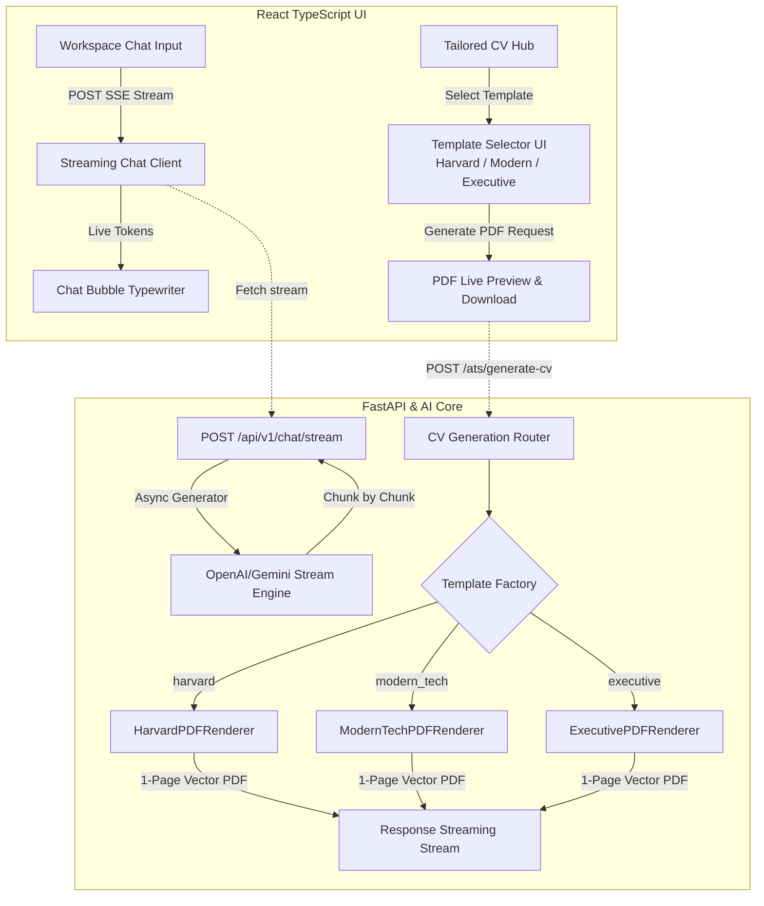

# 📋 KẾ HOẠCH TRIỂN KHAI: STREAMING CHAT (SSE) & ĐA DẠNG MẪU CV (MULTI-TEMPLATE)

> **Mã tài liệu:** `docs/PLAN-streaming-chat-cv-templates.md`  
> **Chế độ:** PLANNING MODE (`project-planner` + `frontend-design` + `api-patterns`)  
> **Trạng thái:** Chờ người dùng phê duyệt trước khi lập trình.

---

## 🎯 MỤC TIÊU DỰ ÁN

Nâng cấp trải nghiệm người dùng trên **Cột 2** và **Cột 3** đạt đẳng cấp SaaS chuyên nghiệp:
1. **Tính Năng 1 (Cột 2):** Nâng cấp Trợ lý AI Copilot sang **Real-Time Streaming Chat (Server-Sent Events - SSE)**, chữ hiển thị mượt mà từng từ (Typewriter Effect), không còn độ trễ chờ đợi.
2. **Tính Năng 2 (Cột 3):** Mở rộng hệ thống xuất CV thành **Multi-Template CV Studio** với 3 phong cách chuẩn quốc tế (Harvard Classic, Modern Tech, Executive Clean) cùng bộ chọn mẫu trực quan.

---

## 🏗️ KIẾN TRÚC KỸ THUẬT CHI TIẾT

---

## 📌 PHÂN RÃ CÁC TÁC VỤ THỰC HIỆN

### PHẦN A: REAL-TIME STREAMING CHAT (SSE) CHO CỘT 2

#### 1. Backend API Layer:
- **Tạo Endpoint Streaming:** `POST /api/v1/chat/stream` sử dụng `StreamingResponse(media_type="text/event-stream")`.
- **Giao thức SSE tiêu chuẩn:**
  - `data: {"type": "token", "content": "..."}\n\n` (Từng từ/ký tự AI sinh ra).
  - `data: {"type": "intent", "intent": "job_search"}\n\n` (Thông báo intent phát hiện).
  - `data: {"type": "jobs", "jobs": [...]}\n\n` (Danh sách việc làm nếu tìm kiếm).
  - `data: [DONE]\n\n` (Kết thúc stream).
- **Hỗ trợ Fallback:** Tự động fallback giữa OpenAI stream và Gemini stream nếu một nhà cung cấp gặp sự cố.

#### 2. Frontend React Layer:
- **Service [`chatApi.ts`](file:///c:/Users/dungv/AI-Career-Agent/fe/src/services/chatApi.ts):** Xây dựng hàm `streamChatMessage()` đọc luồng `ReadableStream` với `TextDecoder`.
- **Giao diện [`WorkspacePage.tsx`](file:///c:/Users/dungv/AI-Career-Agent/fe/src/pages/WorkspacePage.tsx):**
  - Cập nhật state tin nhắn tức thời khi từng chunk token đến.
  - Con trỏ nhấp nháy (Blinking cursor) khi đang stream.
  - Tự động cuộn mượt xuống đáy hội thoại (`scrollIntoView`).

---

### PHẦN B: BỘ XUẤT CV ĐA MẪU CHUẨN ATS (MULTI-TEMPLATE CV STUDIO)

#### 1. Bộ 3 Template Chuẩn Quốc Tế:

| Tên Template | Phong Cách Thiết Kế | Phù Hợp Cho | Đặc Điểm Kỹ Thuật |
| :--- | :--- | :--- | :--- |
| **1. Harvard Classic** *(Mặc định)* | Học thuật, trang nhã, truyền thống | Mọi ngành nghề, Finance, Consulting | Phông Times/Serif, gạch chân mảnh, phân cấp đơn cột |
| **2. Modern Tech** *(Mới)* | Hiện đại, sắc nét, công nghệ cao | Software Engineer, Data, DevOps, AI | Phông Sans-serif (Helvetica/Inter), điểm nhấn màu ngọc lục bảo (Emerald Accent), skill badge gọn gàng |
| **3. Executive Clean** *(Mới)* | Sang trọng, thoáng đãng, chuyên nghiệp | Senior, Tech Lead, Engineering Manager | Phân khối tiêu đề nổi bật, dãn dòng thanh lịch, tập trung vào Impact & Leadership |

#### 2. Kiến Trúc Backend Render:
- **Mô hình Renderer Factory:**
  - File [`be/core/cv_renderer.py`](file:///c:/Users/dungv/AI-Career-Agent/be/core/cv_renderer.py) mở rộng thành `CVRendererFactory.get_renderer(template_name)`.
  - Triển khai `ModernTechPDFRenderer` và `ExecutiveCleanPDFRenderer` kế thừa bộ kiểm soát tràn trang `<= 285mm`.
- **Cập nhật Schemas:**
  - `GenerateCVRequest.template: Literal["harvard", "modern_tech", "executive"] = "harvard"`.

#### 3. Giao diện Người Dùng ([`TailoredCVHub.tsx`](file:///c:/Users/dungv/AI-Career-Agent/fe/src/components/TailoredCVHub.tsx)):
- **Bộ Chọn Template (Template Selector):** 3 Thẻ lựa chọn có hình minh họa và mô tả trực quan.
- **Tùy Chọn Ngôn Ngữ & Mẫu:** Chọn song song `Tiếng Việt / English` và `Harvard / Modern Tech / Executive`.
- **Xem Trước & Tải Về:** PDF được render tức thì theo mẫu đã chọn.

---

## 🧪 KẾ HOẠCH KIỂM THỬ VÀ XÁC MINH (VERIFICATION PLAN)

1. **Unit & Integration Tests (Backend):**
   - `test_chat_stream_endpoint`: Kiểm tra stream trả về đúng chuẩn SSE và kết thúc bằng `[DONE]`.
   - `test_cv_renderer_templates`: Kiểm tra cả 3 template (`harvard`, `modern_tech`, `executive`) đều sinh ra PDF hợp lệ, không lỗi overflow trang 2.
2. **Kiểm Thử Giao Diện (Frontend Build):**
   - Chạy `npm run build` trong `fe/` đảm bảo 0 lỗi TypeScript.
3. **Chạy Master Checklist:**
   - `python -X utf8 .agent/scripts/checklist.py .` đạt chuẩn 6/6.
